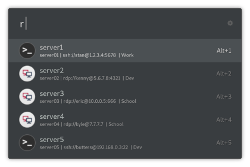

# ulauncher-remmina

🖥 [Ulauncher](https://ulauncher.io) extension for quick access to [Remmina](https://remmina.org) profiles.

You can enter several queries to match strings in profiles' descriptions (e.g. `r ssh stan`)

Some icons from the [Numix project](https://github.com/numixproject) and [Remmina](https://github.com/FreeRDP/Remmina).



## Flatpak Users

For Flatpak users, the following configuration need to be applied:

1) User need to guarantee ```remmina``` is on PATH. A example of a way to reach this requirement is run the following command:

```
mkdir -p ~/.local/bin/remmina
ln -s /var/lib/flatpak/exports/bin/org.remmina.Remmina ~/.local/bin/remmina
```

Alter the path ```~/.local/bin/remmina``` to a place existent on $PATH variable. Fedora - as example - accept this path.

2) The path ```~/.var/app/org.remmina.Remmina/data/remmina/``` need to be added to **Remmina Profile Directory** on Extensions -> Remmina configuration,


